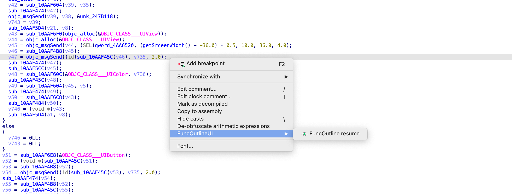
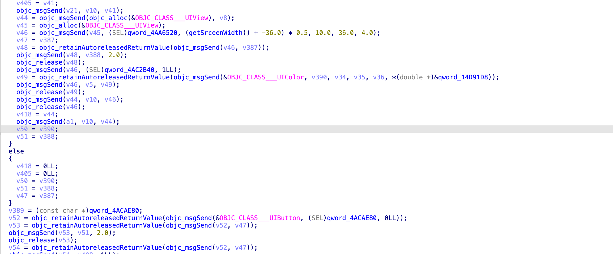

# IDAFuncOutline
FuncOutline is an IDA plugin designed to optimize the readability of decompiled code for iOS ARM64 binaries. Due to compiler optimizations, small functions are often extracted and referenced, making it inconvenient to read the decompiled code in IDA. FuncOutline aims to restore these extracted functions back into the decompiled view for improved code comprehension.
## Install
- Copy funcoutline.py to IDA Pro's plugin folder:

  - On Windows, the folder is at C:\Program Files (x86)\IDA 9.0\plugins

  - On Linux/macOS, the folder may be at /Applications/IDA\ Professional\ 9.0.app/content/macos/plugins/
- funcOutline is confirmed to work on IDA Pro version 9.0+
### Usage
- Select the "FuncOutlineUI" menu in Pseudocode view.
- click "FuncOutline resume"
    - brefore
        
    - after
        